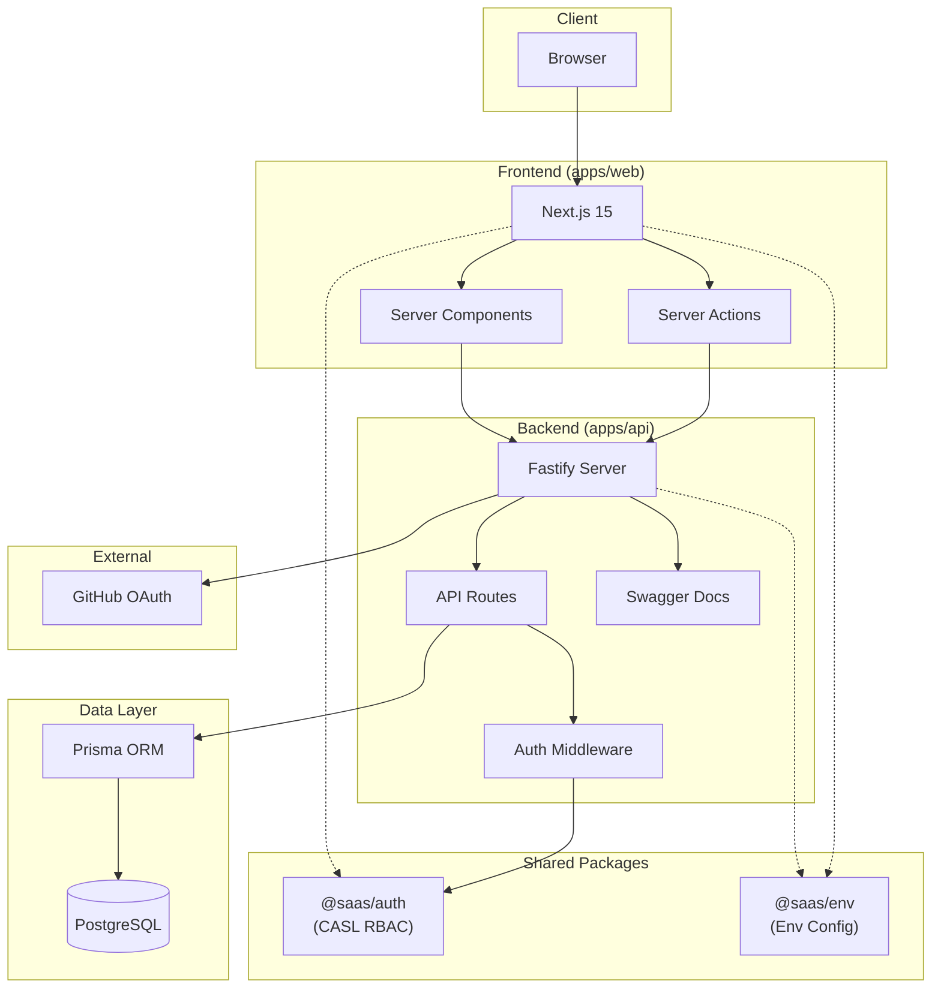
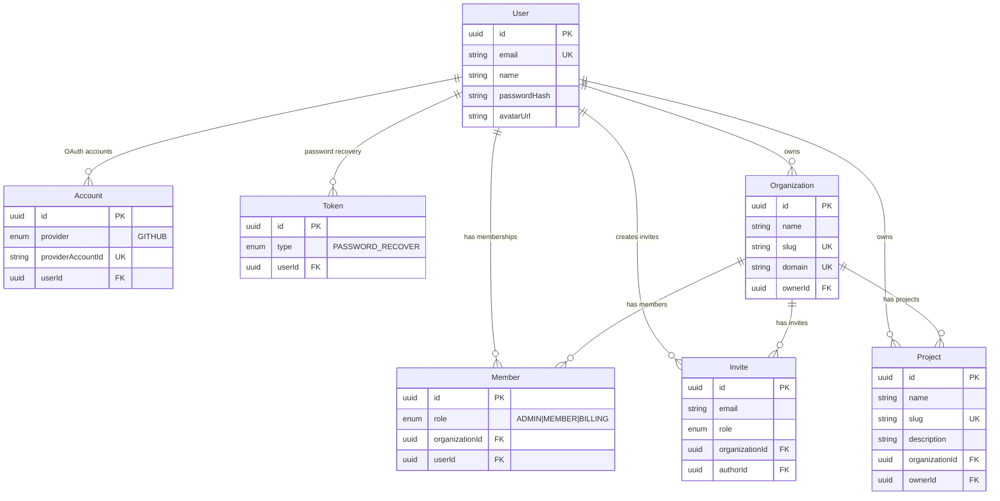
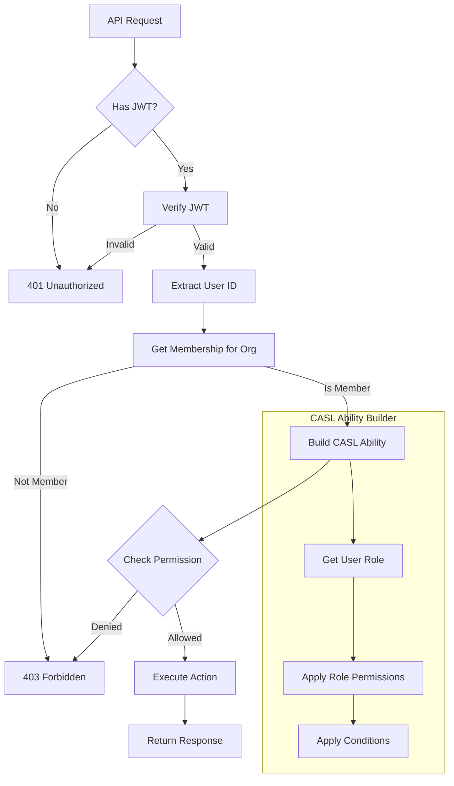
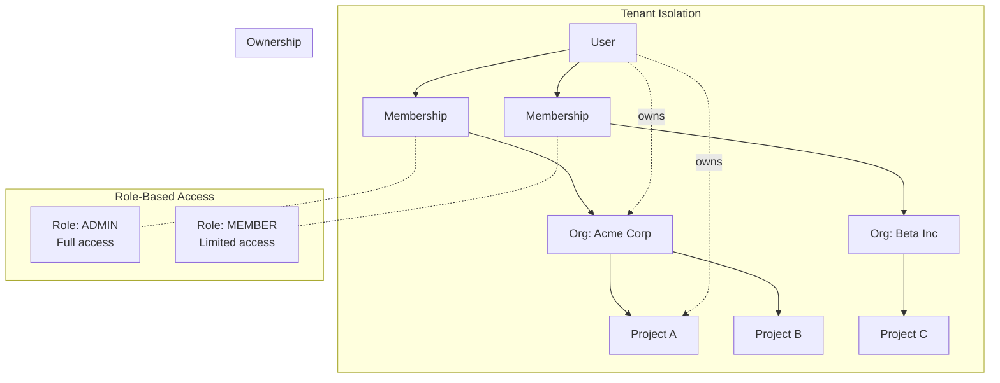

# Multi-Tenant RBAC SaaS Template

This project contains all the necessary boilerplate to setup a multi-tenant SaaS with Next.js including authentication and RBAC authorization.

## Architecture

### System Overview



### Data Model



### Authentication Flow

```mermaid
sequenceDiagram
    participant U as User
    participant W as Web (Next.js)
    participant A as API (Fastify)
    participant DB as PostgreSQL
    participant GH as GitHub

    rect rgb(40, 40, 40)
        Note over U,DB: Email/Password Authentication
        U->>W: Submit credentials
        W->>A: POST /sessions/password
        A->>DB: Find user by email
        DB-->>A: User record
        A->>A: Verify password (bcrypt)
        A-->>W: JWT Token (7 days)
        W->>W: Store in cookies
        W-->>U: Redirect to dashboard
    end

    rect rgb(40, 40, 40)
        Note over U,GH: GitHub OAuth Authentication
        U->>W: Click "Sign in with GitHub"
        W->>GH: Redirect to OAuth
        GH-->>W: Authorization code
        W->>A: POST /sessions/github
        A->>GH: Exchange code for token
        GH-->>A: Access token
        A->>GH: GET /user
        GH-->>A: User profile
        A->>DB: Upsert user + account
        A-->>W: JWT Token (7 days)
        W-->>U: Redirect to dashboard
    end
```



### Authorization Flow (RBAC)



### Multi-Tenancy Model



## Project Structure

```
├── apps/
│   ├── web/          # Next.js frontend
│   └── api/          # Fastify backend
├── packages/
│   ├── auth/         # RBAC utilities (CASL)
│   └── env/          # Environment configuration
└── config/
    ├── eslint-config/
    ├── prettier/
    └── typescript-config/
```

## Getting Started

### Prerequisites

- Node.js >= 18
- pnpm 9.15.9
- Docker (for PostgreSQL)

### Setup

```bash
# Install dependencies
pnpm install

# Start PostgreSQL
docker compose up -d

# Run database migrations
pnpm --filter @saas/api db:migrate

# Seed the database (optional)
pnpm --filter @saas/api db:seed

# Start development servers
pnpm dev
```

## Scripts

| Command          | Description                        |
| ---------------- | ---------------------------------- |
| `pnpm dev`       | Start all apps in development mode |
| `pnpm build`     | Build all apps                     |
| `pnpm lint`      | Run ESLint across all apps         |
| `pnpm typecheck` | Run TypeScript type checking       |

## CI/CD

GitHub Actions workflows run on every push and PR to `main`:

| Workflow     | Checks                  |
| ------------ | ----------------------- |
| **CI - Web** | Lint, Type Check, Build |
| **CI - API** | Lint, Type Check        |

Workflows use path filtering to only run when relevant files change.

## RBAC

Roles & permissions.

### Roles

- Owner (count as administrator)
- Administrator
- Member
- Billing (one per organization)
- Anonymous

### Permissions table

|                        | Administrator | Member | Billing | Anonymous |
| ---------------------- | ------------- | ------ | ------- | --------- |
| Update organization    | ✅            | ❌     | ❌      | ❌        |
| Delete organization    | ✅            | ❌     | ❌      | ❌        |
| Invite a member        | ✅            | ❌     | ❌      | ❌        |
| Revoke an invite       | ✅            | ❌     | ❌      | ❌        |
| List members           | ✅            | ✅     | ✅      | ❌        |
| Transfer ownership     | ⚠️            | ❌     | ❌      | ❌        |
| Update member role     | ✅            | ❌     | ❌      | ❌        |
| Delete member          | ✅            | ⚠️     | ❌      | ❌        |
| List projects          | ✅            | ✅     | ✅      | ❌        |
| Create a new project   | ✅            | ✅     | ❌      | ❌        |
| Update a project       | ✅            | ⚠️     | ❌      | ❌        |
| Delete a project       | ✅            | ⚠️     | ❌      | ❌        |
| Get billing details    | ✅            | ❌     | ✅      | ❌        |
| Export billing details | ✅            | ❌     | ✅      | ❌        |

> ✅ = allowed
> ❌ = not allowed
> ⚠️ = allowed w/ conditions

#### Conditions

- Only owners may transfer organization ownership;
- Only administrators and project authors may update/delete the project;
- Members can leave their own organization;

## Features

### Authentication

- [x] It should be able to authenticate using e-mail & password;
- [x] It should be able to authenticate using Github account;
- [x] It should be able to recover password using e-mail;
- [x] It should be able to create an account (e-mail, name and password);

### Organizations

- [x] It should be able to create a new organization;
- [x] It should be able to get organizations to which the user belongs;
- [x] It should be able to update an organization;
- [x] It should be able to shutdown an organization;
- [x] It should be able to transfer organization ownership;

### Invites

- [x] It should be able to invite a new member (e-mail, role);
- [x] It should be able to accept an invite;
- [x] It should be able to revoke a pending invite;

### Members

- [x] It should be able to get organization members;
- [x] It should be able to update a member role;

### Projects

- [x] It should be able to get projects within a organization;
- [x] It should be able to create a new project (name, url, description);
- [x] It should be able to update a project (name, url, description);
- [x] It should be able to delete a project;

### Billing

- [x] It should be able to get billing details for organization ($20 per project / $10 per member excluding billing role);
